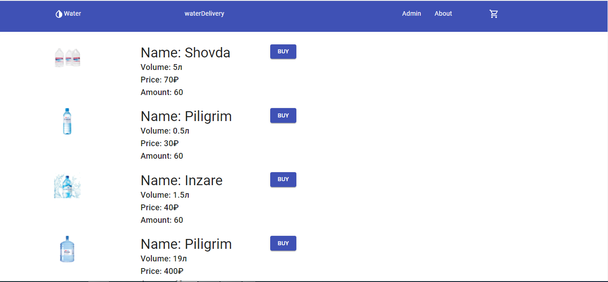
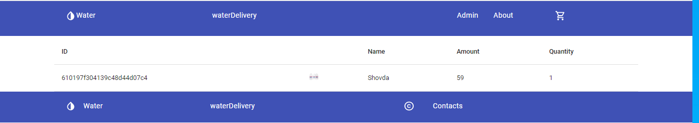
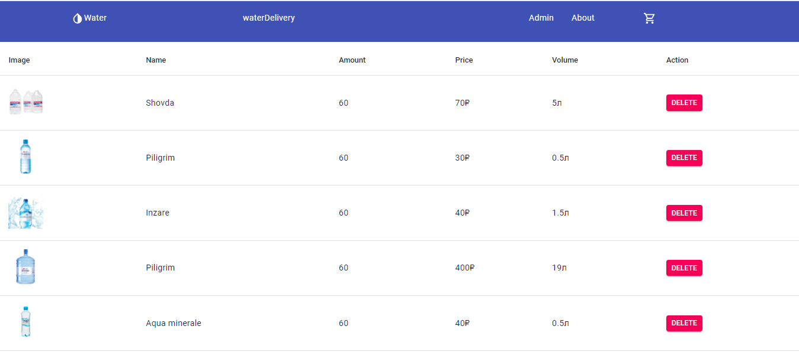
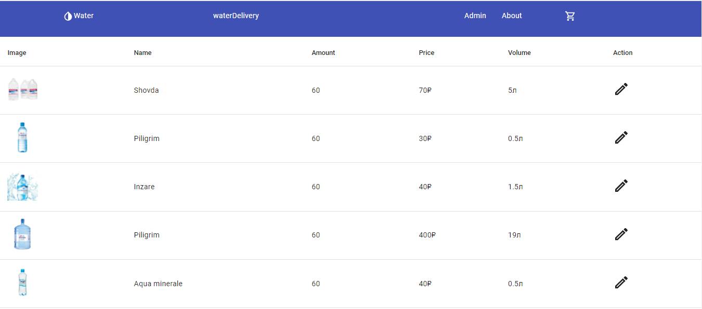
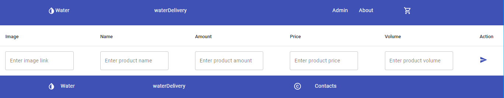

## Приложение разработано для облегчения продажи воды.

###  Здесь вы можете покупать воды различных производителей.

#### Чтобы запустить приложение надо:  и в терменале git ввести команду git clone 

<ul>
<li>1: Форкнуть репозиторий себе на github</li>
<li>2: Затем скопировать ссылку репозитория</li>
<li>3: В терменале git ввести команду git clone [ссылка репозитория]</li>
<li>4: Запустить в WebStorm или VSCode сначала ввести в терминале cd solo-project</li>
<li>5: Затем ввести npm run dev</li>
</ul>

#### Home page

#### Cart page

#### Delete product page

#### Edit product page

#### Add product page

